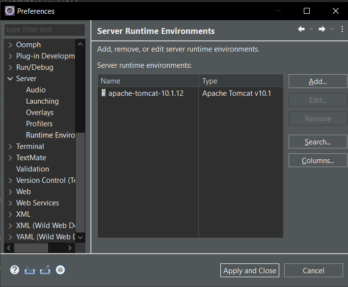
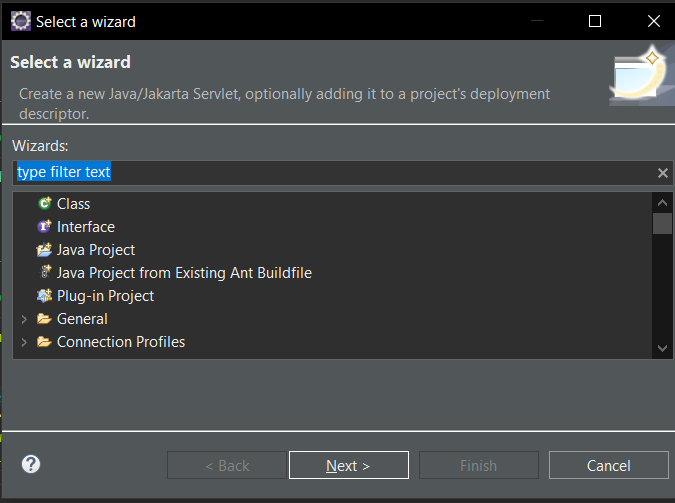
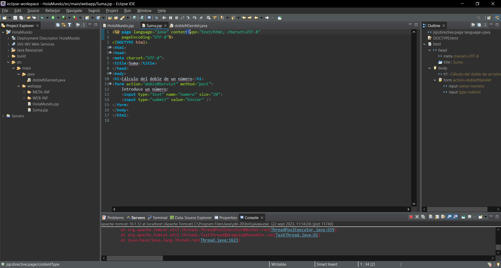
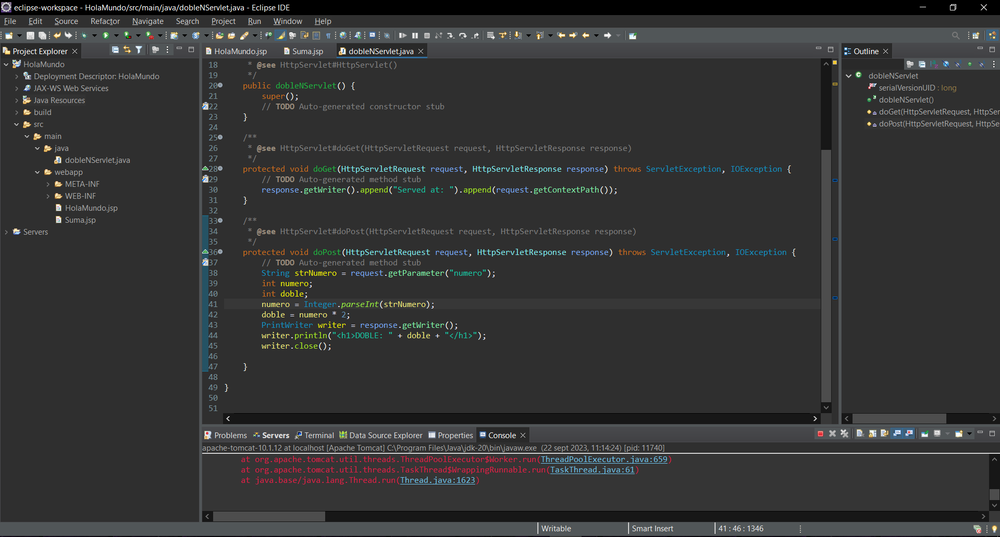
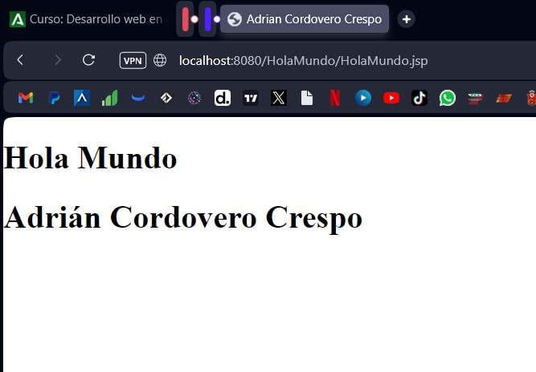
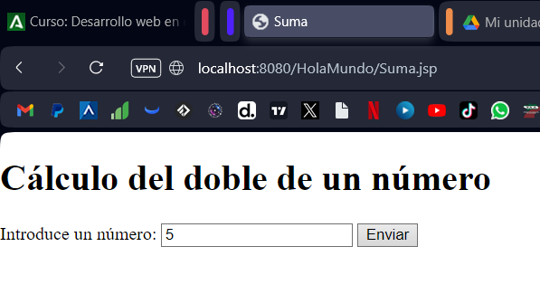
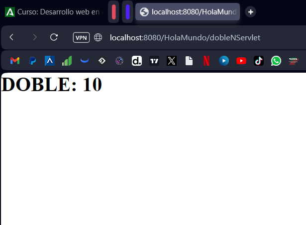

Instalamos Eclipse IDE.

Añadimos el server de Apache Tomcat. (Window - Preferences - Server - Runtime
Environment)

Creamos un proyecto (File - New - Other)

Una vez tenemos el proyecto creado, creamos los archivos JSP.

Creamos el HolaMundo.jsp

Creamos el Suma.jsp

Por último creamos el servlet

El resultado final sería el siguiente

